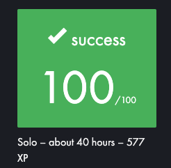

# Born 2 Be Root

42 School's project Born 2 Be Root is an introduction the Virtual Machines Manipulation.

## OBJECTIVES

- Create a Virtual Machine
- Configure it
- Install firewall, password policy, SSH
- Create a monitoring file and display it
