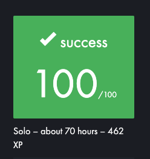

# LIBFT

42 School 1st project : Libft, is a project made to help the student create their first library.
The student must recode a few functions of basic C library that they will be using during their whole C cursus.


This project has been modified, adding some functions not requested in the subject.

This lib has been sorted so that each function enters its category.


#### LISTS :

Contains functions that interacts with lists

```
t_lstadd_back(), ft_lstadd_front(), ft_lstclear(), ft_lstdelone(), ft_lstiter()
ft_lstlast(), ft_lstmap(), ft_lstnew(), ft_lstsize()
``` 

#### MEMORY

Contains functions that interacts with memory

```
ft_bzero(), ft_calloc(), ft_memchr(), ft_memcmp(), ft_memcpy(), ft_memmove(), ft_memset()
```

#### STRINGS

Contains functions that interacts with strings

```
ft_atoi(), ft_isalnum(), ft_isalpha(), ft_isascii(), ft_isdigit(), ft_isprint(), ft_itoa(),
ft_putchar_fd(), ft_putendl_fd(), ft_putnbr_fd(), ft_putstr_fd(), ft_split(), ft_strchr(),
ft_strdup(), ft_striteri(), ft_strjoin(), ft_strlcat(), ft_strlcpy(), ft_strlen(), ft_strmapi(),
ft_strncmp(), ft_strndup(), ft_strnstr(), ft_strrchr(), ft_strtrim(), ft_substr(), ft_tolower(),
ft_toupper()
```
*SOME ADDITIONAL FUNCTIONS*

```
ft_doublefree(), ft_strdoublelen(), ft_strdoubledup()
```



